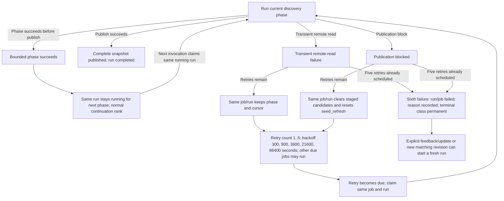

# ADR-0016: Discovery continuation scheduling and bounded retries

- Status: Accepted
- Date: 2026-10-06
- Related:
  [Architecture](../architecture.md),
  [Gallery variants](../gallery-variants.md),
  [ADR-0009: External interface latency budgets](./0009-external-interface-latency-budgets.md)

## Context

Discovery advances one bounded phase per worker invocation. FIFO ordering could
interleave work such as A1, B1, C1, A2, B2, leaving each partial snapshot idle
while other groups accumulated. Repeatedly retrying one failed discovery at
the front of the queue could also delay unrelated work. The job claim counter
includes successful phase continuations, so it cannot represent a separate
finite budget for failures.

## Decision

Claim due jobs by descending priority. Within the same priority, a normal
discovery continuation with a `running` run ranks before every other job type;
then order by `available_at` and job ID. A higher-priority job always wins.
Dry-run uses this same order. A normal continuation is an unfinished snapshot
resuming after a successful phase. Each worker invocation still advances at
most one network discovery group.

A retryable discovery run does not receive continuation rank. Its queued job
must be due according to `available_at` and competes with other same-priority
jobs by the normal time and ID order. Thus the continuation preference does
not bypass failure backoff.

Track discovery failures in `variant_discovery_runs.retry_count`, separately
from claim and phase counts. Failures one through five queue the same durable
job with delays of 300, 900, 3,600, 21,600, and 86,400 seconds. A sixth
transient remote-read failure or publication block marks both run and job
failed and records the exhaustion diagnostic and last cause. The terminal
`last_error_class` is `permanent` so the existing lifecycle outcome counter
records exhaustion; the diagnostic retains the transient or publication
reason, and an exhausted publication block keeps its `blocked_reason` and
component count. Configuration and other already-permanent failures remain
immediate terminal failures.

Retries reuse the same job and run. A transient remote-read retry retains its
phase and cursor. A publication-block retry clears staged candidates and
restarts at seed refresh; if exhausted, it retains the blocking evidence. The
same job remains queued behind other work during backoff, while preserving its
cursor where applicable. This avoids creating a new job generation for every
failure and avoids an unbounded retry cycle.

After exhaustion, automatic discovery scheduling suppresses the failed run for
the current matching revision. A later explicit feedback or `variants update`
can enqueue a fresh job while retaining the failed run as history; a new
matching revision can also make automatic discovery due again. Automatic
retrying at the same revision is deliberately not provided. If operations
need a more direct recovery path, add an explicit operator retry action rather
than removing the finite cap.

## Error and recovery flow

## Consequences

Successful discovery phases run contiguously ahead of same-priority work,
including evaluation and reconciliation jobs. This can delay same-priority
jobs while a healthy discovery snapshot completes; higher priorities are
unaffected, only one discovery group advances per invocation, and retries
yield through `available_at` backoff. A discovery that repeatedly fails stops
after five scheduled retries and remains visible as a failed run with its
diagnostic. Separate retry state requires schema migration 031.
