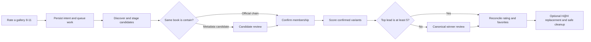

# Gallery Variants

Yomiko's gallery-variant workflow finds ExHentai/E-Hentai galleries that may
represent the same Chinese tankoubon, asks for human confirmation when identity
is uncertain, chooses the most desirable confirmed variant, and converges
ratings, favorites, downloads, and local archive retention in the background.

The workflow starts when a downloaded gallery receives a local rating from `8`
through `11`. Feedback returns after recording the intent; discovery and remote
changes are handled by the independent variant worker.

When an existing database is upgraded to schema version 009, every historical
user rating from `1` through `11` is automatically added as a discovery seed.
The migration performs local SQLite writes only: it does not repeat ratings,
change favorites, request H@H downloads, delete archives, or make network
calls. Normal actions are projected only after discovery and any required
identity or winner reviews and evaluation finish.

## Configure favorite categories

Set two different ExHentai favorite category numbers before relying on favorite
routing:

```dotenv
YOMIKO_CANONICAL_FAVORITE_CATEGORY=0
YOMIKO_ALTERNATE_FAVORITE_CATEGORY=1
```

Both values must be integers from `0` through `9`. Missing, invalid, or equal
values pause only favorite actions with a visible configuration error. Rating,
discovery, review, H@H, and archive-retention work continues, and favorite
actions retry after the configuration is corrected.

The normal ExHentai credentials configured with `yomiko login` are also needed
for discovery and remote actions. No additional feature flag is required. The
container scheduler runs `yomiko variants work` every five minutes in both web
and CLI-only deployments.

## Rating behavior

Yomiko treats `11` as "keep the best variant." ExHentai accepts ratings only up
to `10`, so local `11` is submitted remotely as `10`.

| Local rating | Variant behavior | Archive behavior |
| --- | --- | --- |
| `1` ~ `7` | An ungrouped gallery uses the original feedback path. A confirmed group is deactivated, the rating is propagated, and group favorites are removed. | Existing archives are deleted under the normal low-rating rules. No replacement is requested. |
| `8` ~ `10` | Creates or reactivates a group, discovers variants, propagates the exact rating, and routes canonical/alternate favorites. | Local copies are deleted after intent is recorded. No replacement is requested. |
| `11` | Behaves like a remote rating of `10`, but selects and retains the best confirmed variant. | Keeps an existing archive until the canonical archive is safely committed; requests the canonical through H@H only when necessary, then removes alternates. |

Submitting a later rating below `8` on any confirmed member deactivates the
whole group. Submitting `8` through `11` again reactivates the existing group.
The most recent group feedback becomes the desired rating for every confirmed
member.

### Historical-rating backlog

The schema-009 backfill queues historical discovery below fresh feedback and
policy work, but above annual rediscovery. A library with many historical
ratings can therefore have a substantial queue after upgrade. This is expected:
the normal worker advances only one network discovery group per invocation,
and a group usually needs several durable continuations. At the default
five-minute schedule, a large backlog can take days to finish. Keep the normal
request budgets, search throttling, and schedule in place while it drains.

## End-to-end workflow



Discovery is resumable and publishes only a complete snapshot. A partial
search, failed metadata call, worker crash, or expired lease never replaces the
last completed group state or starts actions from incomplete evidence.

### Discovery and identity

Automated discovery is deliberately limited to galleries containing both
`language:chinese` and `other:tankoubon`. It:

- refreshes every confirmed member used as a search seed;
- follows official `first`, `parent`, and `current` gallery-chain links;
- searches normal and expunged results separately using creator and distinctive
  title queries;
- fetches normalized gallery metadata in batches and collects favorite/rating
  popularity counts; and
- revisits active groups after 365 days or when the code-owned matching
  revision changes.

An in-scope official-chain result is confirmed automatically unless it is
already confirmed in another active group; that cross-group case requires a
review before groups are merged. Every independently discovered metadata match
also requires review. Different uploaders, titles, page counts, scan quality,
or digital editions are evidence, not automatic rejection.

Candidate evidence includes normalized title similarity, exact artist/group
overlap, content-tag overlap, page-count proximity, search origin, missing
fields, and contradictions. Its `0` ~ `100` metadata score orders review evidence
only; it never substitutes for a same-book decision. Expunged galleries remain
fully eligible and receive no score penalty.

File and image-similarity discovery is not implemented. Manual decisions are
authoritative and survive rediscovery and scoring-policy changes.

### Review candidates and winners

With the web service enabled, open:

```text
http://YOUR_YOMIKO_HOST:62080/feedback.html
```

The **Variant reviews** tab shows a pending count and two kinds of cards:

- Candidate reviews compare one source gallery with a possible variant. Choose
  **Same book** or **Different book**.
- Winner reviews show complete score breakdowns for variants separated by less
  than five points. Choose the gallery that should be canonical.

Review mutations use the same API token as feedback. A stale review is rejected
and the page refreshes current state instead of overwriting a newer decision.

The equivalent CLI commands are:

```bash
yomiko variants reviews --status pending
yomiko variants resolve REVIEW_ID --decision same-book
yomiko variants resolve REVIEW_ID --decision different-book
yomiko variants resolve REVIEW_ID --decision winner --gid GALLERY_GID
```

A same-book decision can merge two active groups; Yomiko retains their history,
uses the older group as the survivor, and keeps the most recent feedback intent.
Candidate decisions add durable manual match evidence. A manual winner applies
only to that evaluation, so newly discovered members or a new scoring policy
can require another winner review.

## Canonical scoring

Identity matching and canonical scoring are independent. Only confirmed
same-book members are scored. The default editable policy is:

```json
{
  "format_version": 1,
  "tag_scores": {
    "other:full color": 100,
    "other:uncensored": 100
  },
  "title_substring_scores": {},
  "posted_rank_step": 1
}
```

Each variant's score is the sum of:

- configured exact-tag scores;
- configured title-substring scores, each counted once after Unicode NFKC
  normalization and full case folding across both titles;
- `posted` rank multiplied by `posted_rank_step`, where older distinct dates
  start at rank `1` and equal dates share a rank;
- `floor(min(favorite_count / 10, 500))`; and
- `floor(min(max((rating - 3) * rating_count / 2, 0), 500))`.

Missing popularity counts contribute zero. All raw values, matches, formula
results, and subtotals are stored in the evaluation breakdown. Expunged state
does not affect the score.

The highest score wins when it leads the runner-up by at least five points. A
smaller lead creates a winner review containing every variant within less than
five points of the top score. Rating propagation can continue while that review
is pending, but canonical-dependent favorite, H@H, and rating-11 cleanup work
waits.

### Inspect or change the scoring policy

Export the active compact policy:

```bash
yomiko variants policy-show --pretty > variants-policy.json
```

Edit only `tag_scores`, `title_substring_scores`, and `posted_rank_step`, then
preview the change without mutation:

```bash
yomiko variants policy-check variants-policy.json
```

Activate it after reviewing the hashes and impact:

```bash
yomiko variants policy-activate variants-policy.json
```

Tag and title values must be integers from `-1000` through `1000`;
`posted_rank_step` must be a nonnegative integer. Unknown keys, malformed tags,
empty title substrings, and title keys that collide after Unicode normalization
are rejected.

Policies are immutable database revisions. Activating equivalent content is a
no-op; a scoring change queues local reevaluation in batches of 100 groups and
does not repeat remote discovery. To restore an older policy, activate a saved
copy through the same validation path.

## Operate the worker

The scheduler normally advances the queue automatically. These commands are
useful for inspection and manual operation:

```bash
# Mutation-free preview; takes no worker lock or lease
yomiko variants work --dry-run --max-jobs 1

# Advance at most one due job
yomiko variants work --max-jobs 1

# Inspect public state for a gallery
yomiko variants list --gid GALLERY_GID
```

`--max-jobs` bounds the supported jobs attempted in one invocation. Additional
fixed bounds keep each pass predictable:

- at most one network discovery group;
- at most eight search requests per discovery continuation, with at least
  three seconds between searches;
- at most four metadata batches of 25 galleries;
- at most 25 gallery-detail popularity requests; and
- at most 25 remote mutations across rating, favorite, and H@H actions.

Local cleanup does not consume the remote-mutation budget. A `continued` result
is normal: the durable cursor or remaining actions will be resumed by a later
scheduler pass.

Jobs and actions use 15-minute leases. Transient failures retry after 5
minutes, 15 minutes, 1 hour, 6 hours, and then 24 hours. Configuration,
permanent, and uncertain outcomes remain visible rather than being guessed as
success. The worker rechecks current group intent before every action sequence,
so a downgrade, merge, reevaluation, or restart cannot safely apply obsolete
intent.

Worker output is written to `logs/yomiko-variants.log` inside the container and
also appears in the Docker log stream:

```bash
docker compose logs --follow yomiko
```

## Archive-retention guarantees

For a rating-11 group, Yomiko requests the canonical gallery through H@H only
when it has no canonical archive, no same-GID directory in the H@H tree, and no
equivalent successful request. Existing alternate archives remain in place
until the canonical archive has been atomically committed.

Cleanup accepts only validated regular archive files. Missing, stale, or unsafe
paths remain visible as evidence and are not recorded as deleted.
`rated_then_deleted_at` is written only after an actual deletion. Startup
reconciliation also repairs the narrow crash window between an archive's final
rename and its retention job being queued.

These rules ensure that a failed request, incomplete download, archive failure,
pending review, or worker restart cannot delete the last retained copy of a
rating-11 group.

## Troubleshooting

Start with the gallery-scoped state and pending reviews:

```bash
yomiko variants list --gid GALLERY_GID
yomiko variants reviews --status pending
yomiko variants work --dry-run --max-jobs 1
```

Common states are:

| State | Meaning |
| --- | --- |
| `candidate_pending` | At least one possible same-book member needs review; evaluation waits. |
| `winner_pending` | Confirmed members scored too closely; canonical-dependent actions wait for a winner. |
| `retryable_error` | A transient or uncertain operation is retained for retry with backoff. |
| `configuration_error` | Deployment configuration must be corrected, commonly the favorite categories. |
| `permanent_error` or `failed` | The worker classified stable invalid input, authentication, or remote behavior; inspect the recorded error and logs. |
| `continued` | The bounded pass succeeded and left a durable continuation for the next run. |

If favorite actions alone show `configuration_error`, verify that both favorite
environment variables are present, distinct, and in range, then recreate the
container so it receives the updated environment. If several remote operations
fail authentication, refresh the ExHentai cookie and confirm it with:

```bash
yomiko whoami
```

Do not edit variant tables or relational group IDs directly. Gallery GIDs and
review IDs are the supported public identifiers, and the CLI is the database
boundary for terminal, API, and web callers.

## Implementation and verification notes

Migrations `005` through `008` add the variant groups, immutable policy and
evaluation history, reviews, resumable discovery state, jobs, actions, leases,
and retention reconciliation. `matching_revision` is code-owned and triggers
rediscovery; scoring policy revisions are operator-owned and trigger local
reevaluation. The native `yomiko-unicode` helper and `jq` provide deterministic
Unicode normalization, matching, policy validation, and scoring without a
Python runtime dependency.

The repository test suite covers fresh and upgraded schemas, policy and Unicode
compatibility, discovery continuation/publication, review and merge behavior,
scoring and ties, feedback lifecycle, retry/lease behavior, remote mutation
budgets, H@H replacement, guarded cleanup, CLI/API output, and web review flows.
Run the authoritative suite in the project image:

```bash
docker compose -f docker/docker-compose.debug.yaml \
  --project-name yomiko-debug run --build --rm yomiko.test
```

See [Architecture](./architecture.md) for the repository-wide CLI, API,
database, and runtime boundaries.
