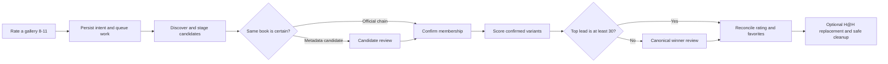

# Gallery Variants

Yomiko's gallery-variant workflow finds ExHentai/E-Hentai galleries that may
represent the same Chinese tankoubon, asks for human confirmation when identity
is uncertain, chooses the most desirable confirmed variant, and converges
ratings, favorites, downloads, and local archive retention in the background.

The workflow starts when a downloaded gallery receives a local rating from `8`
through `11`. Feedback returns after recording the intent; discovery and remote
changes are handled by the independent variant worker.

When an existing database is upgraded to schema version 009, every historical
user rating from `1` through `11` is automatically added as a discovery seed.
The migration performs local SQLite writes only: it does not repeat ratings,
change favorites, request H@H downloads, delete archives, or make network
calls. Normal actions are projected only after discovery and any required
identity or winner reviews and evaluation finish.

## Configure favorite categories

Set two different ExHentai favorite category numbers before relying on favorite
routing:

```dotenv
YOMIKO_CANONICAL_FAVORITE_CATEGORY=0
YOMIKO_ALTERNATE_FAVORITE_CATEGORY=1
```

Both values must be integers from `0` through `9`. Missing, invalid, or equal
values pause only favorite actions with a visible configuration error. Rating,
discovery, review, H@H, and archive-retention work continues, and favorite
actions retry after the configuration is corrected.

The normal ExHentai credentials configured with `yomiko login` are also needed
for discovery and remote actions. No additional feature flag is required. The
container scheduler runs `yomiko variants work` every two minutes in both web and
CLI-only deployments.

## Rating behavior

Yomiko treats `11` as "keep the best variant." ExHentai accepts ratings only up
to `10`, so local `11` is submitted remotely as `10`.

| Local rating | Variant behavior | Archive behavior |
| --- | --- | --- |
| `1` ~ `7` | An ungrouped gallery uses the original feedback path. A confirmed group is deactivated, the rating is propagated, and group favorites are removed. | Existing archives are deleted under the normal low-rating rules. No replacement is requested. |
| `8` ~ `10` | Creates or reactivates a group, discovers variants, propagates the exact rating, and routes canonical/alternate favorites. | Local copies are deleted after intent is recorded. No replacement is requested. |
| `11` | Behaves like a remote rating of `10`, but selects and retains the best confirmed variant. | Keeps an existing archive until the canonical archive is safely committed; requests the canonical through H@H only when necessary, then removes alternates. |

Submitting a later rating below `8` on any confirmed member deactivates the
whole group. Submitting `8` through `11` again reactivates the existing group.
The most recent group feedback becomes the desired rating for every confirmed
member.

### Historical-rating backlog

The schema-009 backfill queues historical discovery below fresh feedback and
policy work, but above annual rediscovery. A library with many historical
ratings can therefore have a substantial queue after upgrade. This is expected:
the normal worker advances only one network discovery group per invocation,
and a group usually needs several durable continuations. At the default
five-minute schedule, a large backlog can take days to finish. Keep the normal
request budgets, search throttling, and schedule in place while it drains.

## End-to-end workflow



Discovery is resumable and publishes only a complete snapshot. A partial
search, failed metadata call, worker crash, or expired lease never replaces the
last completed group state or starts actions from incomplete evidence.

### Discovery and identity

Automated discovery is deliberately limited to galleries containing both
`language:chinese` and `other:tankoubon`. It:

- refreshes every confirmed member used as a search seed;
- follows official `first`, `parent`, and `current` gallery-chain links;
- searches normal and expunged results separately using creator and distinctive
  title queries;
- fetches normalized gallery metadata in batches and collects favorite/rating
  popularity counts; and
- revisits active groups after 365 days or when the code-owned matching
  revision changes.

An in-scope official-chain result is confirmed automatically unless it is
already confirmed in another active group; that cross-group case requires a
review before groups are merged. The chain is automatic evidence only when
the API references validate as `(gid, key)` pairs. Missing or partial
references, token mismatches, conflicting `first`/`parent`/`current` claims,
cycles, branches, and multiple terminals are retained as contradiction
evidence and remain reviewable. Independently discovered in-scope metadata
matches also require review. Titles, uploaders, page counts, scan quality,
digital editions, popularity counts, and timestamps are evidence for review,
not automatic same-book proof.

Yomiko derives replacement visibility from the latest successfully persisted
chain metadata:

```text
eligible := current_gid is null or current_gid == gid
replaced := current_gid is not null and current_gid != gid
```

The normal visible terminal shape has `current_gid` equal to `null`; that value
is not rewritten and does not make a gallery ineligible. `expunged` remains the
independent API field and is never used to represent replacement. A known
replaced gallery may remain a historical member and in frozen evidence, but it
is excluded from new canonical candidates, winner choices, and user-facing
candidate or winner reviews. When a current child is available, discovery
confirms it, retargets the group source when needed, and queues evaluation. If
the child is unavailable, the old canonical and action state remain until a
retryable evaluation can use an eligible child.

During canonical scoring, confirmed members connected by valid official-chain
evidence are treated as one chain component. If that component is the only
eligible canonical component, its terminal eligible child is selected without a
winner review; for example, A-B-C-D selects D. If other confirmed components
remain, only the terminal eligible child represents the automatic component in
winner review; for example, A-B-C plus E reviews C versus E. A replaced
terminal cannot be selected merely because it was the last completed canonical.

Candidate evidence includes normalized title similarity, exact artist/group
overlap, content-tag overlap, page-count proximity, search origin, missing
fields, and contradictions. Its `0` ~ `100` metadata score orders review evidence
only; it never substitutes for a same-book decision. Expunged state remains
separate from replacement: an eligible expunged gallery can still be scored,
while the default score applies its `-1000` expunged penalty.

File and image-similarity discovery is not implemented. Manual decisions are
stored as canonical unordered `(min_gid, max_gid)` pairs. Active confirmed
groups are the current same-book equivalence classes, so membership supplies
symmetry and transitivity. One negative edge between members of two classes
applies to every comparison between those classes. This class-lifted knowledge
is authoritative in either discovery direction and survives annual
rediscovery and scoring-policy changes while the class membership remains.

### Review candidates and winners

With the web service enabled, open:

```text
http://YOUR_YOMIKO_HOST:62080/feedback.html
```

The **Variant reviews** tab shows a pending count and two kinds of cards:

- Candidate reviews compare one source gallery with a possible variant. Only
  one representative of each still-unknown unordered class pair is shown;
  its card reports how many stored comparisons the answer covers. Choose
  **Same book** or **Different book**.
- Winner reviews show complete score breakdowns for canonical representatives
  separated by less than 30 points. Automatic same-book chain members are
  represented by their terminal child; choose the gallery that should be
  canonical.

Review visibility is recomputed from live chain metadata. A review is exposed
only when every source, candidate, or winner choice it would show is eligible;
this includes `current_gid == null` and excludes only a definitely replaced
gallery. Pending reviews that become hidden are superseded with internal
evidence such as `reason: replaced_gallery`. Resolved rows remain audit history,
but a resolved review is omitted from the public response if it exposes a
replaced gallery. Review resolution rechecks this visibility inside its write
transaction, so an already-loaded stale page cannot resolve a newly hidden
review.

Review mutations use the same API token as feedback. A stale review is rejected
and the page refreshes current state instead of overwriting a newer decision.

The equivalent CLI commands are:

```bash
yomiko variants reviews --status pending
yomiko variants resolve REVIEW_ID --decision same-book
yomiko variants resolve REVIEW_ID --decision different-book
yomiko variants resolve REVIEW_ID --decision winner --gid GALLERY_GID
```

A same-book decision merges the complete active classes; Yomiko retains their
history, uses the lowest current group ID as the deterministic survivor
regardless of review direction, and keeps the most recent feedback intent.
Candidate decisions add durable manual match evidence. A manual winner applies
only to that evaluation, so newly discovered members or a new scoring policy
can require another winner review.

Identity decisions are monotonic during normal review resolution. A later
`same_book` decision may replace `different_book` and merge the groups after
checking every existing negative pair edge. A review cannot change
`same_book` to `different_book`, because the merged group does not contain
enough information to infer a safe partition. Use `ungroup` when a
confirmed group must be split explicitly.

### Ungroup identity membership

To detach one or more galleries from their active groups while retaining their
stored user feedback:

```bash
yomiko variants ungroup GID [GID ...]
# Non-interactive confirmation
yomiko variants ungroup GID [GID ...] --force
```

The command takes the variant-worker lock and previews affected groups, pairs,
reviews, memberships, jobs, and actions before confirmation. Each selected GID
is removed from every active and historical membership projection. Every
identity pair and candidate review involving a selected GID is deleted, and
its local `self_rating`, `feedbacked_at`, and gallery `updated_at` remain
unchanged. Each selected gallery is immediately placed in its own fresh source
group using the old group's desired rating, and discovery is queued for that
singleton. This handles confirmed members whose own local `self_rating` is
still `0` without manufacturing user feedback. Ungrouping does not create a
remote rating action, and the selected galleries do not appear in pending
feedback.

Non-selected confirmed members of each touched group remain together in a new
active group. The old source remains the source when possible; otherwise the
lowest remaining GID is selected deterministically. Discovery and evaluation
are queued for that replacement group. If every member was reset, no
replacement group is created.

Candidate rows suppressed by same-class membership, a class-wide negative
edge, or another representative remain as frozen evidence. After ungrouping,
Yomiko recomputes this projection: a comparison reopens automatically when its
former inference no longer holds, while still-supported suppression remains.

Ungrouping is intentionally destructive to candidate identity review evidence
whose source or candidate GID is explicitly selected.
It does not undo already completed remote ratings or favorite changes, restore
deleted archives, or prevent normal official-chain rules from merging the
galleries again after future feedback.

## Canonical scoring

Identity matching and canonical scoring are independent. Only confirmed
same-book members are scored. The default editable policy is:

```json
{
  "format_version": 1,
  "expunged_adjustment": -2000,
  "favorite_popularity_cap": 400,
  "tag_scores": {
    "other:full color": 500,
    "other:incomplete": -500,
    "other:uncensored": 500
  },
  "title_substring_scores": {},
  "page_count": {
    "cap": 100,
    "offset": 70
  },
  "posted_rank_step": 5,
  "rating_confidence_cap": 400
}
```

Each variant's score is the sum of:

- configured exact-tag scores;
- configured title-substring scores, each counted once after Unicode NFKC
  normalization and full case folding across both titles;
- `min(100, filecount - 70)`, so short partial uploads receive a negative page
  score while uploads with at least 170 pages receive the maximum `100`;
- `posted` rank multiplied by `posted_rank_step`, where older distinct dates
  start at rank `1` and equal dates share a rank;
- `floor(min(favorite_count / 10, 400))`; and
- `floor(clamp((rating - 3) * rating_count / 2, 0, 400))`; and
- `-2000` when `expunged` is true.

Missing page and popularity counts contribute zero. Evaluations retain an
immutable scoring snapshot containing the authoritative scoring fields and
the identity/canonical inputs, while `member_scores_json` retains matched
tags/title rules, matched fields, ranks, subtotals, points, totals, and manual
winner overrides. Formula
strings, normalization copies, raw metadata, and policy constants are not
duplicated in the score payload. List and review output derive their compact
breakdowns by joining the referenced evaluation.
The `other:incomplete` tag contributes `-500`. Expunged state contributes
`-2000` only when true.

The highest score wins when it leads the runner-up by at least 30 points. A
smaller lead creates a winner review containing every variant within less than
30 points of the top score. Rating propagation can continue while that review
is pending, but canonical-dependent favorite, H@H, and rating-11 cleanup work
waits.

### Inspect or change the scoring policy

Export the active compact policy:

```bash
yomiko variants policy-show --pretty > variants-policy.json
```

Edit `tag_scores`, `title_substring_scores`, `page_count`,
`posted_rank_step`, `expunged_adjustment`, `favorite_popularity_cap`, or
`rating_confidence_cap`, then preview the change without mutation:

```bash
yomiko variants policy-check variants-policy.json
```

Activate it after reviewing the hashes and impact:

```bash
yomiko variants policy-activate variants-policy.json
```

Tag and title values must be integers from `-1000` through `1000`;
`page_count.cap`, `page_count.offset`, `posted_rank_step`,
`favorite_popularity_cap`, and `rating_confidence_cap` must be nonnegative
integers. `expunged_adjustment` must be an integer from `-10000` through
`10000`. Unknown keys, malformed tags, empty title substrings, and title keys
that collide after Unicode normalization are rejected.

Policies are immutable database revisions. Activating equivalent content is a
no-op; a scoring change queues local reevaluation in batches of 100 groups and
does not repeat remote discovery. To restore an older policy, activate a saved
copy through the same validation path.

## Operate the worker

The scheduler normally advances the queue automatically. These commands are
useful for inspection and manual operation:

```bash
# Mutation-free preview; takes no worker lock or lease
yomiko variants work --dry-run --max-jobs 1

# Advance at most one due job
yomiko variants work --max-jobs 1

# Inspect public state for a gallery
yomiko variants list --gid GALLERY_GID
```

`--max-jobs` bounds the supported jobs attempted in one invocation. Additional
fixed bounds keep each pass predictable:

- at most one network discovery group;
- at most eight search requests per discovery continuation, with at least
  three seconds between searches;
- at most four metadata batches of 25 galleries;
- at most 25 gallery-detail popularity requests; and
- at most 25 remote mutations across rating, favorite, and H@H actions.

Local cleanup does not consume the remote-mutation budget. A `continued` result
is normal: the durable cursor or remaining actions will be resumed by a later
scheduler pass.

Jobs and actions use 15-minute leases. Transient failures retry after 5
minutes, 15 minutes, 1 hour, 6 hours, and then 24 hours. H@H attempts have a
separate per-GID 12-hour cooldown after the attempt watermark is written,
including uncertain outcomes; expired H@H leases are requeued no earlier than
that exact deadline. A matching GID directory anywhere in the H@H tree is an
active download regardless of age or completion marker and suppresses automatic
requests until it is removed. Configuration, permanent, and uncertain outcomes
remain visible rather than being guessed as success. The worker rechecks
current group intent before every action sequence, so a downgrade, merge,
reevaluation, or restart cannot safely apply obsolete intent.

Worker output is written to `logs/yomiko-variants.log` inside the container and
also appears in the Docker log stream:

```bash
docker compose logs --follow yomiko
```

## Archive-retention guarantees

For a rating-11 group, Yomiko requests the current canonical gallery through H@H
only when it has no safe canonical archive, no same-GID directory anywhere in
the H@H tree, and no active 12-hour per-GID cooldown. Existing alternate
archives remain in place until the canonical archive has been atomically
committed. The cooldown uses `galleries.hath_last_attempted_at`, which records
successful, uncertain, and manual attempts; the historical
`hath_requested_at` value is preserved separately.

Cleanup accepts only validated regular, non-symlink archive files. A safe stale
`file_path` is cleared only after acquiring the per-GID archive lock. Unsafe,
symlink, directory, and other non-regular paths remain visible as diagnostics
and are never cleared or deleted automatically.
`rated_then_deleted_at` is written only after an actual deletion. Startup
reconciliation scans all active completed rating-11 evaluations, repairs the
narrow crash window between an archive's final rename and its retention job
being queued, and supersedes cleanup waiters while the canonical archive is
missing. Archive completion hands cleanup back to the normal reconciliation
projection.

Startup repair uses the canonical gallery state watermark: a completed retention
job covers the archive state when its `completed_at` is at least the gallery's
`updated_at`. Action reconciliation is idempotent, so projecting an already
matching intent does not create a new watermark. After a real projected metadata
change, one retention repair and its action handoff are sufficient to converge.

These rules ensure that a failed request, incomplete download, archive failure,
pending review, or worker restart cannot delete the last retained copy of a
rating-11 group.

## Troubleshooting

Start with the gallery-scoped state and pending reviews:

```bash
yomiko variants list --gid GALLERY_GID
yomiko variants reviews --status pending
yomiko variants work --dry-run --max-jobs 1
```

For queue-wide scheduling and lease diagnostics, query the read-only view
created by migration 017:

```sql
SELECT job_id, job_type, group_id, source_gid, status,
       job_attempt_count, diagnostic_state, active_action_count,
       next_action_available_at, wait_until, reason
  FROM variant_job_diagnostics
 WHERE status IN ('queued', 'leased')
 ORDER BY job_available_at ASC, priority DESC, job_id ASC;
```

Only current queued or leased `reconcile_actions` jobs include action counts
and summaries. Historical jobs and other job types deliberately keep those
fields empty because actions do not retain durable parent-job ownership. Use
`diagnostic_state`, counts, and timestamps for automation; `reason`,
`active_actions`, and `action_errors` are CLI-readable summaries, not an API
format.

Common states are:

| State | Meaning |
| --- | --- |
| `candidate_pending` | At least one unknown identity-class pair needs one representative decision; evaluation waits on both sides. |
| `winner_pending` | Confirmed members scored too closely; canonical-dependent actions wait for a winner. |
| `retryable_error` | A transient or uncertain operation is retained for retry with backoff. |
| `canonical_archive_present` | The current rating-11 canonical archive is a safe regular file; alternate cleanup may proceed. |
| `hath_tree_present` | A current canonical GID directory exists in the H@H tree; automatic requests wait until it is removed. |
| `hath_cooldown` | A prior automatic, uncertain, or manual H@H attempt delays the next automatic request until the recorded deadline. |
| `hath_request_due` | No canonical archive or H@H-tree directory is present and the automatic H@H request may run. |
| `archive_lock_busy` | Another archive operation owns the GID lock; recovery defers filesystem classification. |
| `unsafe_or_non_regular_archive_path` | The recorded canonical path is unsafe or not a regular file; operator review is required. |
| `configuration_error` | Deployment configuration must be corrected, commonly the favorite categories. |
| `permanent_error` or `failed` | The worker classified stable invalid input, authentication, or remote behavior; inspect the recorded error and logs. |
| `continued` | The bounded pass succeeded and left a durable continuation for the next run. |

If favorite actions alone show `configuration_error`, verify that both favorite
environment variables are present, distinct, and in range, then recreate the
container so it receives the updated environment. If several remote operations
fail authentication, refresh the ExHentai cookie and confirm it with:

```bash
yomiko whoami
```

Do not edit variant tables or relational group IDs directly. Gallery GIDs and
review IDs are the supported public identifiers, and the CLI is the database
boundary for terminal, API, and web callers.

## Implementation and verification notes

Migrations `005` through `008` add the variant groups, immutable policy and
evaluation history, reviews, resumable discovery state, jobs, actions, leases,
and retention reconciliation. `matching_revision` is code-owned and triggers
rediscovery; scoring policy revisions are operator-owned and trigger local
reevaluation. Migration `009` backfills historical feedback, migration `010`
adds default page-count scoring, and migration `011` adds the symmetric current
identity-pair projection with conflict-checked review backfill and one
actionable candidate review per unknown class pair. Migration `012` compacts
legacy evaluation payloads, removes the duplicate member breakdown column, and
queues a durable post-migration `VACUUM`. Migration `013` updates the built-in
scoring policy while preserving customized active policies and queues the
corresponding scoring sweep. Migration `014` installs the fixed official-chain
matching and live replacement-visibility policy, preserves the previous policy
revision and scoring/operations hashes, and queues matching-revision
rediscovery without a scoring sweep. It supports customized active scoring
policies and leaves replaced galleries in historical membership/evidence while
excluding them from new canonical and review projections. The native
`yomiko-unicode` helper and `jq` provide deterministic
Unicode normalization, matching, policy validation, and scoring without a
Python runtime dependency. Migration `016` adds the nullable H@H attempt
watermark, backfills successful and possibly-sent attempt evidence, and
normalizes the known blocked rating-11 cleanup state without inspecting the
filesystem. Runtime recovery performs the locked archive/H@H-tree
classification and coalesces the resulting retry work.
Migration `017` adds the read-only `variant_job_diagnostics` view described
above.

The repository test suite covers fresh and upgraded schemas, policy and Unicode
compatibility, discovery continuation/publication, review and merge behavior,
scoring and ties, feedback lifecycle, retry/lease behavior, remote mutation
budgets, H@H replacement, guarded cleanup, CLI/API output, and web review flows.
The repository currently registers 110 test cases. Run the authoritative suite
through an isolated `yomiko-playground`:

```bash
.agents/skills/yomiko-playground/scripts/create_playground.sh --start
# in the generated playground:
./playground test
```

See [Architecture](./architecture.md) for the repository-wide CLI, API,
database, and runtime boundaries.
